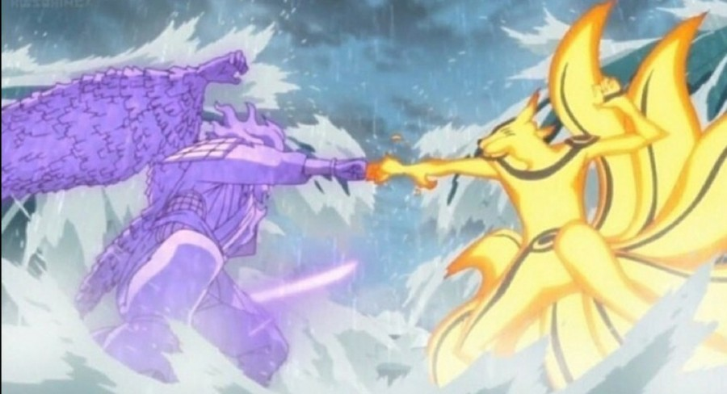

<!doctype html>
<html>
  <head>
    <title>Naruto</title>
    <meta charset="utf-8">
  </head>
  <body>
    <h1><a href="goose.png" target="_blank">🧟</a>‍</h1>
    <h1>미안하다 이거 보여주려고 어그로끌었다..</h1>
    
    <h2><a href="https://youtu.be/PBOiKMtTKds"
    target="_blank" title="나루토 사스케 싸움수준">
    나루토 사스케 싸움수준</a> ㄹㅇ실화냐?</h2>
    <h3>진짜 <u>세계관최강자들</u>의 싸움이다..</h3>
    <h4>그찐따같던 나루토가 맞나? 진짜 나루토는 전설이다..</h4>
    <h5>진짜옛날에 맨날나루토봤는데</h5>
    <h6>왕같은존재인 호카게 되서 세계최강 전설적인 영웅이된나루토보면</h6>
    
진짜내가다 감격스럽고 나루토 노래부터 명장면까지 
    가슴울리는장면들이 뇌리에 스치면서 가슴이 웅장해진다..

    
그리고 극장판에 카카시앞에 운석날라오는 거대한 걸 사스케가 갑자기 
    순식간에 나타나서 부숴버리곤 개간지나게 
    나루토가 없다면 마을을 지킬 자는 나밖에 없다 
    라며 바람처럼 사라진장면은 진짜 나루토처음부터 본사람이면 안울수가없더라 
    진짜 너무 감격스럽고 보루토를 최근에 알았는데 미안하다..

    
지금20화보는데 진짜 나루토세대나와서 너무 감격스럽고 
    모두어엿하게 큰거보니 내가 다 뭔가 알수없는 추억이라해야되나
    그런감정이 이상하게 얽혀있다..

    
시노는 말이많아진거같다 좋은선생이고..

    
그리고 보루토왜욕하냐 귀여운데 나루토를보는것같다 성격도 닮았어

  </body>
</html>
